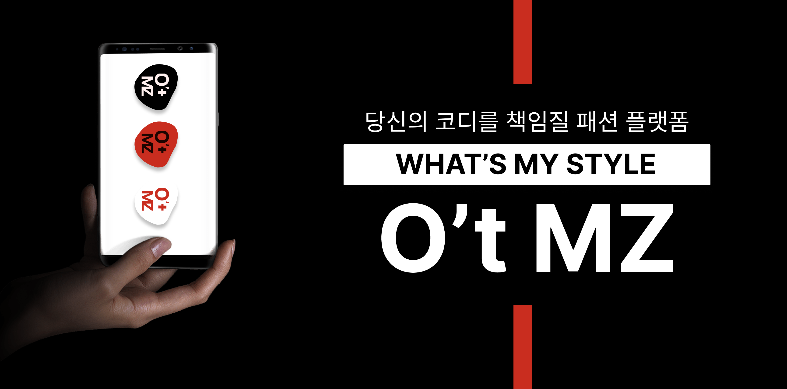

# __O't MZ 👕__

<!-- * 버전 수정 필요: 아무거나 넣어뒀어요 -->

---
## 👥 __팀원 구성__
| 역할 | 이름 | 담당 |
| --: | :-- | :--: |
| 팀장 | 김종근 | BE |
| 팀원 | 양가영 | BE |
| 팀원 | 양윤정 | BE |
| 팀원 | 김희현 | FE, UX/UI |
| 팀원 | 최선호 | FE, 데이터분석 |
| 팀원 | 윤대혁 | AI, 데이터분석 |

  

## __🚩 O't MZ 👕__
### __*"옷은 많은데 입을 옷이 없다"*__

------------------

- __프로젝트 개요__
    - 배포 URL: https://j8c105.p.ssafy.io/

    - `O't MZ` 는 AI를 활용하여 개인의 패션 스타일 성향을 파악하고 관련된 패션 스타일을 추천해주는 웹/앱 서비스입니다.
   

- __주요 기능__
    - __WHAT'S MY STYLE__

    - __디지털 옷장__

    - __실시간 코디 세션__

    - __스타일 레이더 차트__

 

- __기대 효과__

    __1) 퍼스널 스타일링을 제안받을 수 있습니다.__
     : AI 기술을 활용한 자신만의 스타일 판별을 통해 본인에게 맞는 스타일링을 제안받을 수 있습니다.   
    __2) 불필요한 시간, 돈 지출을 줄일 수 있습니다.__
      : 자신의 스타일 인식을 통해 그에 맞는 옷을 구매할 수 있어  
    __3) 공간 확보가 가능합니다.__
     : 디지털 옷장을 활용해 불필요한 아이템을 정리할 수 있고 필요한 아이템들로만 나의 옷장을 채울 수 있습니다.  

- __향후 계획__

  

## __🎞️서비스 소개__
------------------
__1. 로그인 화면__

__2. 메인 화면__

__3. 스타일 찾기__

__4. 디지털 옷장__

__5. 코디북__
- 코디북 생성
- 내 코디를 부탁해

__6. 마이페이지__
- 스타일 차트
    - 스타일 진단 요약 기능
    - 내 옷장 요약 기능