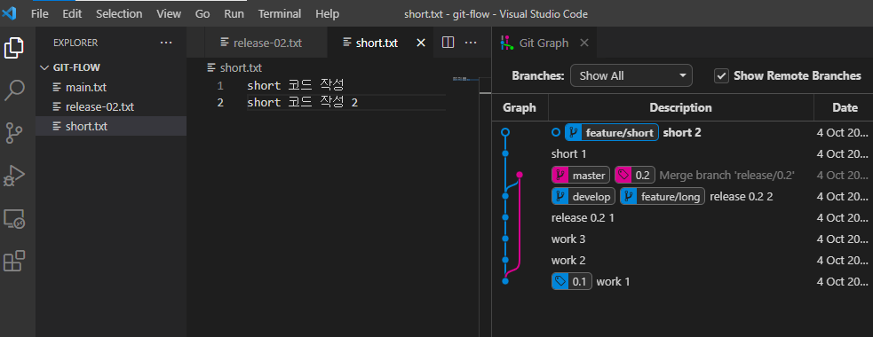

# Git flow 사용법

## git flow vs github-flow 개념 이해

git-flow 

- 5가지의 Branches 를 이용/운영하는 브랜치 전략 한달 이상의 긴 호흡으로 개발하여 주기적으로 배포 , QA, hotfix 수행할 수 있는 여력이 있는 팀의 경우 적합

github-flow 

- master 브랜치와 Pull request를 활용한 단순한 브랜치 전략
- 항상 릴리즈되어야 할 필요가 있는 서비스와 지속적으로 테스트하고 배포하는 팀이라면 github-flow와 같은 간단한 workflow가 적합

## Git Flow Model

### Main Branches

= long-running branches : they remain in your project during its whole lifetime.

**1) Master**

- 제품으로 출시될 수 있는 브랜치 ( main )
- master의 최신버전은 언제나 실행가능해야함

**2) Develop**

- 실행가능한 상태를 만들어가는 과정
- 다음 출시 버전을 개발하는 브랜치

### Temporary Branches

merge 된 후 사라지는 임시 브랜치

**3) feature**

- 기능 개발하는 브랜치
- feature/기능명 으로 생성하고 사용 후 삭제

**4) Release**

- 이번 출시 버전을 준비하는 브랜치
- release/버전명 으로 생성하고 사용 후 삭제
- QA, TEST etc..

**5) Hotfixes**

- 출시한 버전에 긴급하게 수정해서 다시 업데이트 해야할 때
- hotfixes/차기 버전명 으로 생성하고 사용 후 삭제
- bugfix

## Git-flow 개발 프로세스


**git-flow 개발 프로세스**

1. 개발자는 develop branch 로부터 본인이 개발할 기능을 위한

**feature branch 생성**

2. feature branch에서 기능을 만들다가 기능 완성후에 develop branch에 merge

3. 이번 배포 버전의 기능들이 develop branch에 모두 merge 되었다면 QA, TEST 를 위해

**release 브랜치**

생성

4. release branch에서 오류가 발생한다면 release 브랜치 내에서 수정 , QA 가 끝났다면 해당 버전을 배포하기 위해

**master branch로 merge**

한다. bugfix가 있었다면 해당 내용을 반영하기 위해 develop branch에도 merge

5. 만약 제품 (master)에서 버그가 발생한다면

**hotfix branch 생성**

6. hotfix branch에서 bugfix 끝나면

**develop과 master branch에 각각 merge**

## **Git-flow model 실전 연습**

### 1) 기본 세팅

새로운 폴더 / 파일 (main.txt) 생성

생성한 폴더 경로에서 터미널 명령어 입력

```java
git init
```

main.txt 에 코드 입력 후

```java
git add main.txt
git commit -am "work 1"
```


현재 완성된 master 제품을 출시한 상태라고 가정

현재 master 에  "0.1" 이라는 버전을 태그하기

```java
git tag 0.1
```


이제 기능 추가 / 코드 작성 등등을 위한 develop branch를 만들기

### **2) develop branch 생성 및 기능 추가**

```java
git checkout -b develop
```


→  develop branch에서 기능 개선, 버그 수정 등의 코드 작성 후

```java
git commit -am "work 2" 
git commit -am "work 3"
```


요렇게 develop line에서 기능 추가가 이루어짐

### 3) 출시, release 준비 & bugfix

- release braches 들은 언젠가 develop branch에 병합될 임시 브랜치이다

```java
git checkout -b release/0.2
```

이전 출시가 0.1 버전이라 이번 출시 branch 이름을 release/0.2로 지음 


출시하려하는데 고쳐야할 버그들이 보이면 bugfix

release-02.txt 파일 생성 여기서 버그 수정 코드 작성

```java
git add release-02.txt
git commit -am "release 0.2 1"
* 다시 버그 수정 코드 작성 후, 
git commit -am "release 0.2 2"
```


**4) release를 devlop 브랜치로 merge 하기**

```java
git checkout develop 
git merge release/0.2
```


요런 과정을 반복하며 release준비가 끝나면 (잘 작동하는지 확인이 끝나면)

### 5) release 점검 완료 후 master로 **no fast forward merge**

- 일반적인 merge(병합)가아닌 merge commit을 남기는 방식의 병합을 사용할 것

release/0.2가 있는 곳으로 Fast Forward할 것이기 때문에 병합이 어떻게 이루어져있는지 기록이 남겨지지않음 -> merge를 할 때 Fast Forward를 하지마 ! 라고 **"--no-ff"** 명령어 넣어주기

=> commit 메세지를 의도적으로 만드는 것 -> 여기서 release와 병합했다! 라고 commit log상 남기기

- 이렇게 하는 이유? 브랜치가 너무 많아지는 것을 방지

```java
git checkout master 
git merge --no-ff release/0.2
```


```java
git branch -d release/0.2    // release 브랜치는 사용하고 삭제하는 임시 브랜치 
git tag 0.2         // 다시 출시한 버젼 tag 다시 keep 개발ing..
```


→ 다시 keep 개발ing

### 6) Feature Branches

다시 개발 시작 / 기능 추가 등등

```java
git checkout develop
```

추가해야할 신규 기능이 두 가지가 있다고 가정 :

하나는 long-term, 다른 하나는 short-term이라하면 빨리 끝나는 short-term 기능 추가가 되면 먼저 release하고 master merge, 이후에 long-term 기능 추가가 완성되면 다시 반복

feature/short 과 feature/long이라는 기능 추가할 브랜치 생성

```java
git branch feature/short
git branch feature/long
```

1.0버전을 목표로 하는 feature/short 부터 기능 추가

```java
git checkout feature/short
```

short.txt 파일 생성 , 코드 작성 (commmit 2번 )

```java
git add short.txt
git commit -am "short 1"
* 코드 추가 
git add short.txt
git commit -am "short 2"
```



feature/long

```java
git chechout feature/long
```

feature/long으로 checkout하면 방금 만들은 short.txt 파일이 사라져있음! 없었던 때로 돌아감

long.txt 파일 생성 + 코드 작성 + commit 2번 해주기 ! (기능 추가 시 2번 commit했다고 가정)

```java
git add long.txt
git commit -am "long 1"
* 코드 추가 (이후에 add를 안해도 되었음! 위에선 에러(?)가 났었는데 이유는 무엇이지) 
git commit -am "long 2"
```


출시 준비 -> feature 병합작업

```java
git checout develop 
git merge --no-ff feature/short         // commit message를 일부러 만들어주기 by --no-ff
```


```java
git branch -d feature/short
```

이제 release 절차 시작

### 새로운 release/1.0 브랜치 생성

```java
git checkout -b release/1.0
```

만약 short에 문제가 있었다면 feature를 만드는게 아니라 그냥 그대로 **bugfix** 하기

short.txt 코드 수정 (but fix함)

```java
git commit -am "short 3 bug fix"
```


기존의 main.txt에서도 bug fix 했다면

```java
git commit -am "work 4 bug fix'
```


release/1.0 까지 merge 한 상태에서 bugfix를 해나가기 => release 준비 완료

### **7) release/1.0을 develop으로 병합, merge**

```java
git checkout develop 
git merge --no-ff release/1.0
```


```java
git checkout master 
git merge --no-ff release/1.0
```


```java
git tag 1.0 
git branch -d release/1.0            // 다 쓴 release/1.0 branch 삭제
```

→  이제 출시 작업 시작하면 된다 !

### **8) 갑자기 긴급하게 수정해야할 문제 발생 시 => hotfix**

다른 문제들을 해결하고 기능추가 작업을 하고 있는데 심각한 문제가 발생하면 신속하게 처리하기 위해 이전 출시 버전에 hotfix branch사용하여 추가 및 빠르게 업뎃

```java
git checkout -b hotfixes/1.1
```

hotfix-1_1.txt 파일 생성 + 코드 작성

```java
git add hotfix-1_1.txt
git commit -am "hotfix-1_1"
```

******* 여기서 master에도 보내고 & develop에도 보내서 충돌이 일어나지 않도록 하기 *******

```java
git checkout develop
git merge --no-ff hotfixes/1.1
```


```java
git chechout master
git merge --no-ff hotfixes/1.1
git tag 1.1                             //1.1로 tag (출시) 
git branch -d hotfixes/1.1         //삭제
```


### **9) feature/long merge**

```java
git checkout develop 
git merge --no-ff feature/long
git branch -d feature/long 
git checkout master 
git merge --no-ff develop
```


출처 - [https://blckchainetc.tistory.com/352](https://blckchainetc.tistory.com/352)
